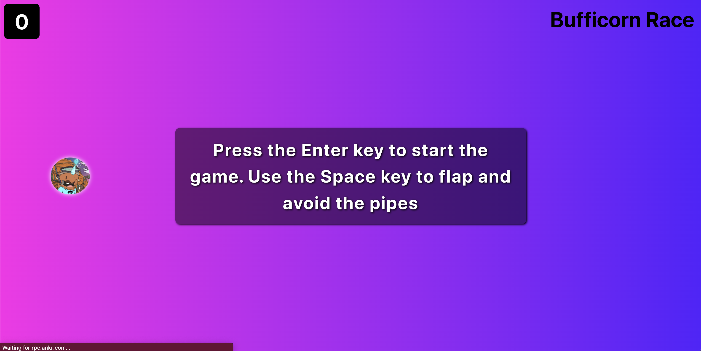

# Civic Pass x Bufficorn Race Game
### Description
Bufficorn Race is a wallet-gated game that's a spin off of the once popular Flappy Bird game. The goal is to stop bots from sabatoshing leaderboards & to record scores on-chain so that highscores will forever reamin - just like the old school arcade games.

### You must connect your wallet to play the game


### Game Starts


## Quick Start

```bash
# Install dependencies
yarn

# Start the app
yarn start

# Start the app with the test gatekeeper network
REACT_APP_GATEKEEPER_NETWORK=tgnuXXNMDLK8dy7Xm1TdeGyc95MDym4bvAQCwcW21Bf yarn start
```
## Credits

Our project's base was: [civic-pass-eth-template](https://github.com/civicteam/civic-pass-eth-template)

## Future Improvements
* Implement leaderboard (Display top 10 accounts + score) & record every score on chain.
  -Perhaps by using Polybase
* Instead of the default bufficorn, people can use their ENS Avatar instead.
  - This should be a quick add on
* Top 10 winners are minted a special POAP for their accomplishment.
  - POAP API
